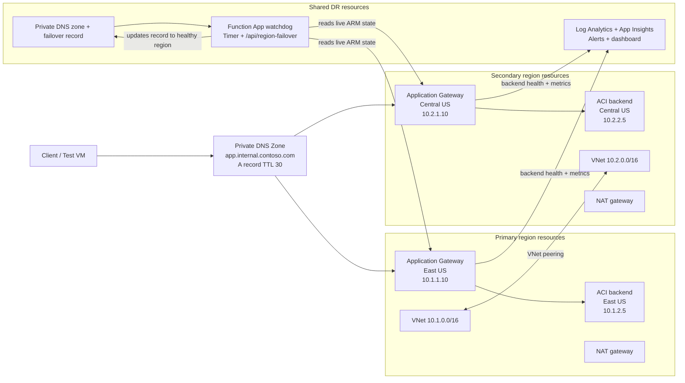

# Private Application Gateway DR

A private-only Application Gateway in East US and Central US, each fronting an
Azure Container Instances backend on a private IP. A watchdog Function App reads
live state from ARM and repoints a private DNS record when a region goes down.

- [DEPLOYMENT.md](DEPLOYMENT.md) — step-by-step deployment, verification, drill, and troubleshooting
- [FILES.md](FILES.md) — what every file does, plus variable, output, and resource references

## Architecture diagram



The rest of this page is the short version.

## Topology

```
Client  -->  app.internal.contoso.com  (private DNS A record, TTL 30)
                 |  10.1.1.10  eastus     (while healthy)
                 |  10.2.1.10  centralus  (after failover)
                 v
         Private Application Gateway  -->  ACI backend (HTTP /)
```

Three resource groups. Each region owns its own so it can be torn down
independently, and a shared group holds what has to survive losing either one.

| | `rg-appgw-dr-eus` | `rg-appgw-dr-cus` | `rg-appgw-dr-shared` |
| --- | --- | --- | --- |
| VNet | `vnet-eus-dr` 10.1.0.0/16 | `vnet-cus-dr` 10.2.0.0/16 | |
| Gateway subnet | `snet-appgw-eus` 10.1.1.0/24 | `snet-appgw-cus` 10.2.1.0/24 | |
| Gateway | `agw-eus-dr` at 10.1.1.10 | `agw-cus-dr` at 10.2.1.10 | |
| Backend subnet | `snet-aci-eus` 10.1.2.0/24 | `snet-aci-cus` 10.2.2.0/24 | |
| Backend | `aci-eus-dr` | `aci-cus-dr` | |
| Outbound | `nat-aci-eus` | `nat-aci-cus` | |
| DNS | | | `internal.contoso.com` + `app` record |
| Watchdog | | | Function App on a B1 plan |
| Monitoring | | | Workspace, App Insights, action group, alerts, dashboard |

Both VNets are peered in each direction.

## How failover works

```
Stop the primary ACI
  -> watchdog sees container state != Running and does not wait for metrics
  -> UnhealthyHostCount and the ACI stop activity log also POST /api/region-failover
  -> PUT the private DNS A record = 10.2.1.10
  -> fail back only once the container is Running again
```

Three signals, one decision function. The 30-second timer is the primary path;
the two alerts are a second path that shortcuts the wait. Both call the same
code, and that code always re-reads live state from ARM rather than trusting an
alert payload, so a stale or spurious alert cannot move traffic and repeated
calls are harmless.

Failback deliberately requires the container to be running *now*. A
`HealthyHostCount` sample can be minutes old, and acting on one is how traffic
gets returned to a region that is still down.

## Design notes worth knowing before reading the code

**The gateways have no public frontend.** Each `frontend_ip_configuration` has a
static private address and no `public_ip_address_id`. That requires the
`EnableApplicationGatewayNetworkIsolation` feature and delegation of the gateway
subnet to `Microsoft.Network/applicationGateways`.

**Health comes from ARM, not from the network.** The watchdog reads container
group state and calls the gateway's `backendhealth` action. It never probes the
private frontends, so it needs no VNet integration — which in turn is why it can
sit on a plain B1 plan.

**No keys and no secrets anywhere.** Every ARM call uses
`ManagedIdentityCredential` against the app's system-assigned identity, and even
`AzureWebJobsStorage` is identity-based. The identity holds a purpose-built role
with three read operations plus `Private DNS Zone Contributor` on the single
zone.

**The code must be built on the platform.** Publishing goes through
`az functionapp deployment source config-zip --build-remote true`. A prebuilt
package with `WEBSITE_RUN_FROM_PACKAGE` leaves `azure-identity` uninstalled, the
app imports nothing, and the watchdog silently never runs. `SCM_DO_BUILD_DURING_DEPLOYMENT`
and `ENABLE_ORYX_BUILD` are set for the same reason, and `WEBSITE_RUN_FROM_PACKAGE`
is deliberately absent from `app_settings` so Terraform removes it if anything
adds it.

**Always On is why the plan is B1.** A dedicated plan idles its workers out
without it, which would stall the 30-second timer.

**The DNS record is Terraform-created but watchdog-owned**, so it carries
`ignore_changes = [records]`. Without that, the first plan after a failover would
propose dragging traffic back to the dead region.

## Quick start

```powershell
./scripts/register-prereqs.ps1          # once per subscription
Copy-Item terraform.tfvars.example terraform.tfvars
$env:ARM_SUBSCRIPTION_ID = (az account show --query id -o tsv)
terraform init
terraform apply
```

Expect 25 to 35 minutes; the two gateways dominate. You need Owner or
Contributor **plus** User Access Administrator, because the stack creates its own
role definition and assignments.

## Verify and drill

```powershell
./scripts/dr-drill.ps1 validate    # inventory, backend health, DNS, alerts, watchdog
./scripts/dr-drill.ps1 failover    # stop the primary backend, wait for DNS to move
./scripts/dr-drill.ps1 restore     # start it again, wait for the watchdog to fail back
./scripts/dr-drill.ps1 webhook     # post a synthetic alert, print the decision
```

The dashboard is the **Private Application Gateway DR** workbook in the shared
resource group: healthy and unhealthy hosts for both gateways, and the
watchdog's own decisions.

## Layout

```
modules/region/      VNet, delegated subnets, NAT, ACI, gateway, diagnostic settings
main.tf              Three resource groups, both regions, peering, client subnet
dns.tf               Private DNS zone, VNet links, failover A record
function_app.tf      Storage, B1 plan, watchdog app, code publish
rbac.tf              Custom watchdog role and every role assignment
monitoring.tf        Workspace, App Insights, action group, alerts, dashboard
function/            Python watchdog: timer plus /api/region-failover
scripts/             Subscription prerequisites and the drill
```

## Teardown

```powershell
terraform destroy
```
